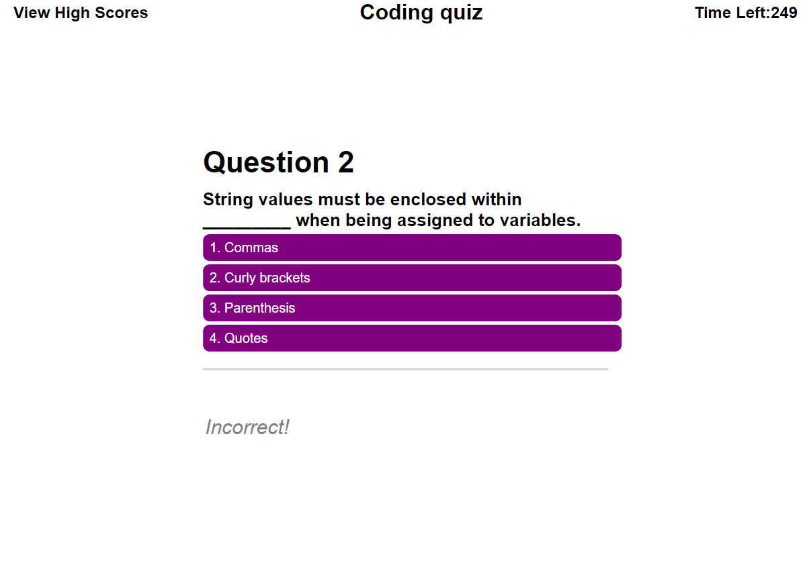

# BusyQuizzer

https://edellenator.github.io/BusyQuizzer/

A brief quiz to test development knowledge.

## App details

Built using HTML, CSS, and Javascript focused on DOM manipulation to create interative HTML elements and locally stored information.

## App functionality screen grabs

app begins on home page with a start button

start button prompts rules screen

Cancel returns to start screen, start begins quiz and initiates timer

Incorrect answers display deduct 10 seconds

After final question or timer reaches 0 finalscore and highscore are displayed. If you have the new high score, your score is stored in local storage

